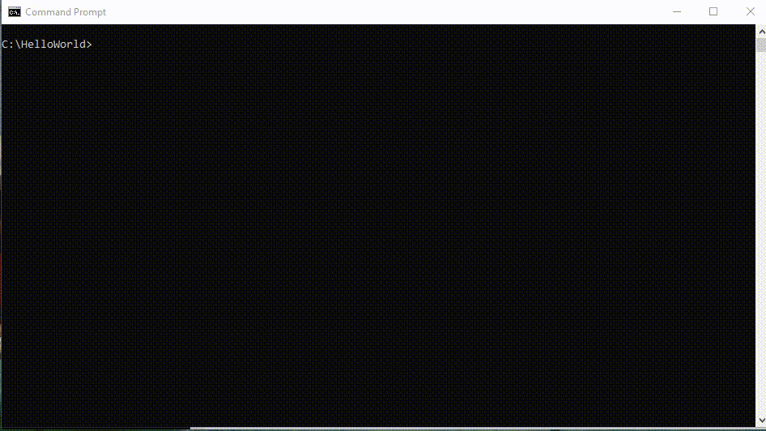

# API Testing using Karate Framework
## What is Karate Framework?
<table border="0">
  <tr>
    <td></td>
    <td>
      Karate is open source tool which is used to test API. Even UI testing can be done using Karate framework.  Karate framework is an extension of Cucumber frameworks, obviously follows the behavior-driven development (BDD) and test cases written in Gherkin.
    </td>
  </tr>
 </table>
 
## About Gherkin
Gherkin is a human readable language created 	especially for behavior descriptions. Gherkin is a line oriented language; each statement is separated by new line.

### Gherkin Syntax
```cucumber
Feature: Brief description about test. Just for reference.
Background:
  # Optional section, used to define common variable across scenarios

Scenario: Brief description about scenario. Just for reference
  # Scenario Steps, Input and Expected Result
  # Given Context / Input Data
  # When Event 
  # Then Expected Result
Scenario: Another scenario
  # Scenario Steps, Input and Expected Result
  # Given Context / Input Data
  # When Event 
  # Then Expected Result
```
Let create a feature to test find the tallest among two persons: 

```cucumber
Feature: Find the tallest

Scenario: Find the tallest
  # Given John height is 5 ft and Peter height is 6 ft
  # When Find the tallest button clicked 
  # Then John is taller
```

For more information about the Gherkin language, [click here](https://docs.behat.org/en/v2.5/guides/1.gherkin.html)

### Hello World!

It is a time-honored tradition to start a programming with a “Hello World” program.   

```cucumber
Feature: Hello World!

Scenario: Hello World!
  * print "Hello World!"
```
 
Save the above content to "HelloWorld.feature" file in a temporary directory. 
### Environment
Now our first feature is ready, but how to run this feature file using Karate framework. It can be done different ways: Maven, Gradle and Standalone. We will be using Gradle in this article.
#### Tools Required

* [JDK](https://www.oracle.com/ca-en/java/technologies/javase-jdk11-downloads.html)
* [Gradle](https://gradle.org/install/)

### Build and Run 

Create "HelloWorld" app :


Please add the following in the "HelloWorld\app\build.gradle" file

* Add Karate dependency
```groovy
    // This dependency is used by the karate test.
    testImplementation 'com.intuit.karate:karate-apache:0.9.6'
    testImplementation 'com.intuit.karate:karate-junit5:0.9.6'
```

* Update test resource path, so feature file and java file ( test runner file ) can be placed in the same path. 
```groovy
sourceSets {
    test {
        resources {
            srcDirs = ['src/test/resources','src/test/java'] // define `src/test/resources` and `src/test/java` as resource folders
            exclude '**/*.java'
        }
    }
}
```

Please update the following in the HelloWorld\app\src\test\java\HelloWorld\AppTest.java
* Import Karate classes
```java
import com.intuit.karate.junit5.Karate;
```

* Add Runner method
```java
    @Karate.Test
    Karate HelloWorld() {
        return Karate.run("HelloWorld").relativeTo(getClass());
    }
```

* Remove generated test method

Place "HelloWorld.feautre" file which is created earlier in "HelloWorld\app\src\test\java\HelloWorld\". Now do the build:


Build is completed, test case/ features are tested and also fancy report is generated.

### API Testing

Created BookStore API with following CRUD operation: 

Note: Used dotnet core to create this API, please feel free to use otherwise create your own.

<table>
<tr>
  <th>Operation/HTTP Operation</th>
  <th>URL</th>
  <th>Input</th>
  <th>Expected output</th>
</tr>
<tr>
  <td>Create/Post</td>
  <td>http://localhost:5000/BookStore/CreateBook</td>
  <td><pre>
  json
  {
    "Title" : "Title1",
    "BookNumber" : "Book1",
    "Category" : "Cateogry1",
    "Languauge" : "English",
    "Author" : "Author1"
  }    
  </pre></td>
  <td>200</td>
</tr>
<tr>
  <td>Retrieve/Get</td>
  <td>http://localhost:5000/BookStore/RetreiveBook</td>
  <td>BookNumber</td>
  <td>200</td>
</tr>
<tr>
  <td>Update/Put</td>
  <td>http://localhost:5000/BookStore/CreateBook</td>
  <td><pre>
  json
  {
    "Title" : "Title Updated",
    "BookNumber" : "Book1",
    "Category" : "Cateogry Updated",
    "Languauge" : "English",
    "Author" : "Author Updated"
  }    
  </pre></td>
  <td>200</td>
</tr>
<tr>
  <td>Delete/Delete</td>
  <td>http://localhost:5000/BookStore/DeleteBook</td>
  <td>BookNumber</td>
  <td>200</td>
</tr>
</table>

* Let us create a feature to test this API. Begin with Create Book scenario

```cucumber
Feature: Test Book Store

Background:
    * url 'http://localhost:5000/BookStore/'
    * configure report = { shouldLog : true, showAllSteps : true }

Scenario: Create Book
    * def model = 
    """
    {
        "Title" : "Title1",
        "BookNumber" : "Book1",
        "Category" : "Cateogry1",
        "Language" : "English",
        "Author" : "Author1"
    }
    """

    Given path 'CreateBook'
    And request model
    When method post
    Then status 200
```

URL is common  across scenarios, so it is defined in the "Background" section. Input request is defined in "model" variable and offset given the "path". Additional offset can be added "Add" command.

* Continue with Retreive scenario:

```cucumber
  Scenario: Retrieve Book
    
    Given path 'RetrieveBook'
    And param bookNumber = 'Book1'
    When method get
    Then status 200
```

* Continue with Update Scenario:
```cucumber
  Scenario: Update Book
    * def model = 
    """
    {
        "Title" : "Title Updated",
        "BookNumber" : "Book1",
        "Category" : "Category Updated",
        "Languauge" : "English",
        "Author" : "Author Updated"
    }
    """

    Given path 'UpdateBook'
    And request model
    When method put
    Then status 200
```
* Last one is delete scenario:
```cucumber
  Scenario: Delete Book

    Given path 'DeleteBook'
    And param bookNumber = 'Book1'
    When method delete
    Then status 200
```

Now BookStore.feature is file ready. Please create a runner class as explained earlier. Keep feature and runner class in the "HelloWorld\app\src\test\java\BookStore" folder. Execute test by running "gradle clean test" command




